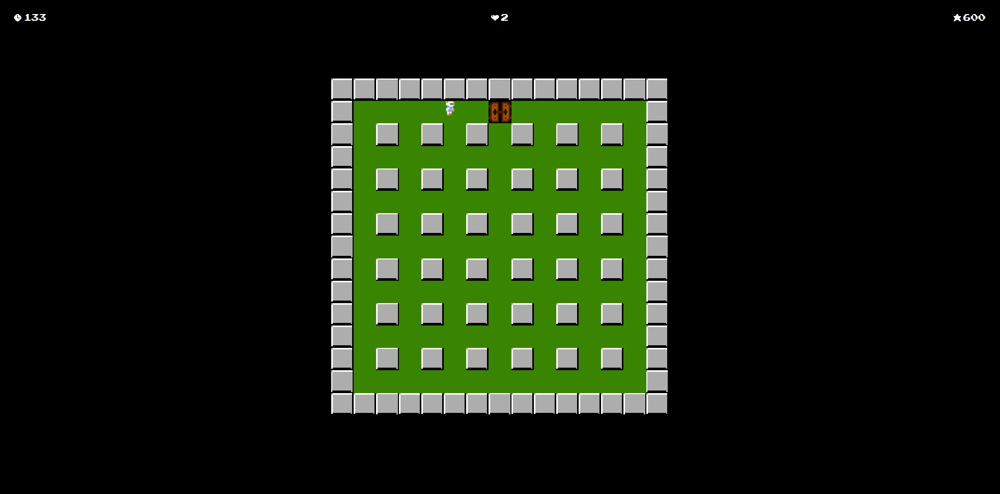

# Make your game
* Frontend application for [backend](https://github.com/innovember/make-your-game)
* Analogue of the 1985 Bomberman game on the NES console

## How to start the game
* Open the index.html file with live-server extension on VSCode or another editors like Webstorm

## Power ups
* About the power ups in the game you can read [here](https://strategywiki.org/wiki/Bomberman/How_to_play)

## Controls
* WASD - move
* Space - leave a bomb
* Escape - pause game
* UpArrow, DownArrow - switch between game menu choices
* Enter - choose option in game menu
* E - detonate the oldest bomb (only in case player has detonator power-up)

## Screenshots
* Main menu

* Leaderboard

* Gameplay

* New stage

* Enter a score

* Ending

